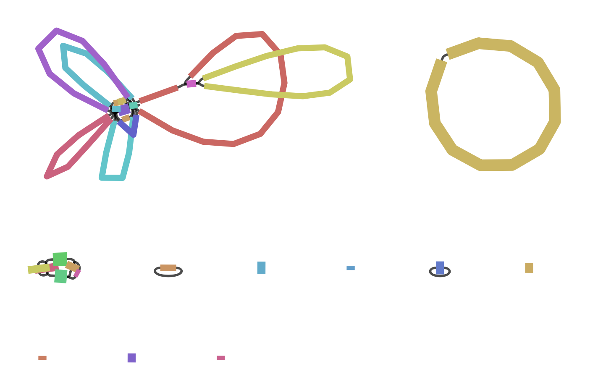
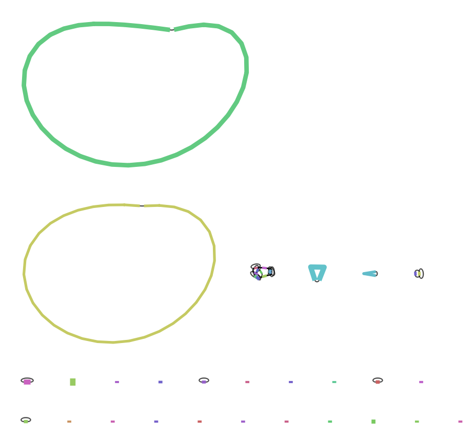

## New Words

__mangrove:__ noun. 红树

__antagonistic:__ adjective. 敌对的

__saprobic fungi:__ 腐生真菌

__Coelomycetes:__ a class of conidial fungi where the conidia are formed within a cavity lined by fungal or host tissue. 

__conidium:__ is an asexual, non-motile spore of a fungus. 

__conidia:__ plural of conidium.

__motile:__ able to move by itself (especially of plants, organisms, and very small forms of life). 

__morphology:__ 形态学。The scientific study of the structure and form of animals and plants. 

__haploid:__ adjective. 单倍体

__metagenomics:__ is the study of the structure and function of entire nucleotide sequences isolated and analyzed from all the organisms (typically microbes) in a bulk sample. Metagenomics is often used to study a specific community of microorganisms, such as those residing on human skin, in the soil or in a water sample.

__microbe:__ noun. 微生物


## Cytospora

__Expected genome size:__ 40Mb, haploid 

Read this paper to learn something about Cytospora - [Discovery of three novel cytospora species in Thailand and their antagonistic potential](https://www.mdpi.com/1424-2818/13/10/488) 


## Copy the dorado basecalled bam file to dayhoff

`/mnt/data/dayhoff/home/scratch/u1133824/genome-assembly/cytospora_duplex.bam` 

## How to use NanoPlot

__NanoPlot takes sorted bam files as input, what do you mean sorted? sorted by lengths?__

There is an option --ubam, we can use this option for unmapped bam file which is the bam file from dorado basecaller. 

```sh
NanoPlot --ubam $bam_file 
```

__NanoPlot results:__

The `NanoPlot-report.html` file is similar to FastQC, and it's also the main file we want to look at.

__Is the output bam file from Dorado sorted?__ 

No, they're not sorted. 

__What does N50 means in the plot?__

N50 statistic defines assembly quality in terms of contiguity. Given a set of contigs, the N50 is defined as the sequence length of the shortest contig at 50% of the total assembly length. It can be thought of as the point of half of the mass of the distribution; the number of bases from all contigs longer than the N50 will be close to the number of bases from all contigs shorter than the N50. For example, consider 9 contigs with the lengths 2,3,4,5,6,7,8,9,and 10; their sum is 54, half of the sum is 27, and the size of the genome also happens to be 54. 50% of this assembly would be 10 + 9 + 8 = 27 (half the length of the sequence). Thus the N50=8, which is the size of the contig which, along with the larger contigs, contain half of sequence of a particular genome. Note: When comparing N50 values from different assemblies, the assembly sizes must be the same size in order for N50 to be meaningful.

N50 can be described as a weighted median statistic such that 50% of the entire assembly is contained in contigs or scaffolds equal to or larger than this value.

__How do I know the error rate of my sample?__

It depends on the Kit, sequencing machine, and basecaller. We can usually find the information on the company website. For our sample, we are using new flow cell, new kit, and new dorado basecaller. The sample accuracy would be very high, >99%. 

## Trimming and Filtering

__How should I filter it? What quality threshold should I set? Should I remove any sequence shorter than or longer than something?__

... 

## Verkko Assembler

https://github.com/marbl/verkko 

Verkko is a hybrid assembly pipeline developed for telomere-to-telomere assembly of PacBio HiFi and Oxford Nanopore reads. 

Verkko uses Canu to correct remaining errors in the HiFi reads, builds a multiplex de Bruijn graph using MBG, aligns the Oxford Nanopore reads to the graph using GraphAligner, progressively resolves loops and tangles first with the HiFi reads then with the aligned Oxford Nanopore reads, and finally creates contig consensus sequences using Canu's consensus module. 

__What is de Bruijn graph?__ 

... 

Verkko installed via conda: 

```sh
conda create -n verkko -c conda-forge -c bioconda -c defaults verkko 
```

__Seems like it needs both PacBio hifi and ONT long-reads?__

Read the paper to find out. 

__Assembly without filtering:__

...

## Flye Assembler

https://github.com/fenderglass/Flye 

Flye is a de novo assembler for single-molecule sequencing reads, such as those produced by PacBio and Oxford Nanopore Technologies. It is designed for a wide range of datasets, from small bacterial projects to large mammalian-scale assemblies. 

The package represents a complete pipeline: it takes raw PacBio/ONT reads as input and outputs polished contigs. Flye also has a special mode for metagenome assembly. 

__What are single-molecule sequencing reads?__

...

__Conda install Flye:__

```sh
conda create -n flye
conda activate flye
conda install -c bioconda flye
```

__Flye cannot take .bam file as input:__ 

Go to dorado website to see if we can convert bam file to fastq? Yes, use samtools to convert. 

Use separate conda environment for samtools 1.18

```sh
samtools bam2fq sample.bam > sample.fastq 
```

### Flye Assemblies - No Filtering 

__Assembly 01 - with only `--nano-raw`:__ 

Flye said there is no need to filter reads. See this [do i need to preprocess my reads](https://github.com/fenderglass/Flye/blob/flye/docs/FAQ.md#do-i-need-to-preprocess-my-reads-in-any-way). 

```sh
flye --nano-raw sample.fastq --out-dir outdir --threads 10
```

Returned error:

```
[2023-11-23 05:27:14] ERROR: No disjointigs were assembled - please check if the read type and genome size parameters are correct
[2023-11-23 05:27:14] ERROR: Pipeline aborted
```

According to [GitHub - Flye does not generate any output](https://github.com/fenderglass/Flye/issues/128). It might be because there are a lot of overlaps. We can try use the `--meta` metagenome mode and `--asm-coverage 50` use the longest 50x reads for disjointig assembly. 

__Assembly 02 - with `--nano-raw` and `--asm-coverage 50`:__

What does the `--asm-coverage` option mean?

...

*Run flye:*

```sh
flye --nano-raw sample.fastq --out-dir outdir --threads 10 --asm-coverage 50 -g 40m
```

*Error:* out of memory for 30GB reservation. Try with 100GB. 

*Final graph*:


__Assembly 03 - with `--nano-raw` and `--meta`:__

```sh
flye --nano-raw sample.fastq --out-dir outdir --threads 10 --meta 
```

*Final graph:* 


__Assembly 04 - with only `--nano-hq`:__

Our sample is sequenced with the latest Nanopore technology, new flow cell, new kit, and new basecaller, so the error rate would be less than 5%. We can use the `--nano-hq` option. 

```sh
flye --nano-hq sample.fastq --out-dir outdir --threads 10
```

*Final graph:* 



__Assembly 05 - with `--nano-hq` and `meta`:__ 

*Code:* 

```sh
flye --nano-hq sample.fastq --out-dir outdir --threads 10 --meta 
```

*Final graph:* 




## Visualising Results - AGB

https://github.com/almiheenko/AGB

Use AGB to visualise. 

__Install AGB:__

```sh
conda create -n AGB
conda activate AGB
conda install -c almiheenko agb
```

__Run AGB:__

```sh
agb.py --graph final_graph.gfa -a flye
```

Results in the `viewer.html` file. Cannot see anything in the html file. Try bandage. 

## Visualising Results - Bandage

__Install Bandage:__

Download and install the Windows version from the website https://rrwick.github.io/Bandage/ 

__Use Bandage:__

Download the `.gfa` files and load into bandage. 

## Canu Assembler

https://github.com/marbl/canu

Canu is a fork of the Celera Assembler, designed for high-noise single-molecule sequencing (such as the PacBio RSII/Sequel or Oxford Nanopore MinION).

### Install Canu

```sh
curl -L https://github.com/marbl/canu/releases/download/v2.2/canu-2.2.Linux-amd64.tar.xz --output canu-2.2.Linux.tar.xz 
tar -xJf canu-2.2.Linux.tar.xz
```

### Run Canu

By default, Canu will correct the reads, then trim the reads, then assemble the reads to unitigs. Canu needs to know the approximate genome size (so it can determine coverage in the input reads) and the technology used to generate the reads. 

Example code for Nanopore:

```sh
canu \
-p ecoli -d ecoli-oxford \
genomeSize=4.8m maxInputCoverage=100 \
-nanopore ecolk12mg1655_R10_3_guppy_345_HAC.fastq
```

__Default parameter run:__

```sh
/mnt/data/dayhoff/home/u1133824/software/canu-2.2/bin/canu \
-p cytospora -d /mnt/data/dayhoff/home/scratch/u1133824/genome-assembly/canu-assemblies/01-default \
genomeSize=40m maxInputCoverage=100 \
-nanopore /mnt/data/dayhoff/home/scratch/u1133824/genome-assembly/cytospora_duplex.fastq 
```

If I use the above code in a SLURM script, the script would finish very quick but the program is actually running in the background. Try add the `wait` command in the sbatch script next time. 

Canu does not generate graphs, the result is inside `cytospora.contigs.layout.tigInfo`:

```
#tigID  tigLen  coverage        tigClass        sugRept sugBubb sugCirc numChildren
2       4736707 31.78   contig  no      no      yes     15007
3       417908  317.54  contig  no      no      yes     15481
4       270572  39.90   contig  no      no      yes     1072
5       80223   434.48  contig  no      yes     yes     4486
6       61660   84.10   contig  no      yes     no      623
10      91600   216.54  contig  no      no      yes     2386
11      64204   21.89   contig  no      yes     no      177
12      5353873 240.01  contig  no      no      yes     146498
13      47798   17.24   contig  yes     no      no      70
14      1706    1.00    unassm  no      no      no      1
15      6605    1.00    unassm  no      no      no      1
16      5146    1.00    unassm  no      no      no      1
...
...
```

# Separate the result contigs to different files

Shell script to do this:

```sh
#!/bin/bash

input_file="assembly.fasta"
output_directory="split_contigs"

# Create output directory
mkdir -p "$output_directory"

# Split the input FASTA file into individual files
awk '/^>/{f=sprintf("%s/%s.fasta", "'"$output_directory"'", substr($1,2)); next;} {print > f;}' "$input_file"
```

# BLAST the draft assemblies 

Check GenBank cytospora assemblies, and map our contigs to those assemblies to get the correct contigs. Then we can blast the contigs to NCBI database to remove contaminate contigs and mitochondria DNA. 

## Install BLAST+ & download nt databse

https://www.ncbi.nlm.nih.gov/books/NBK52640/ 

The above link is the tutorial for install BLAST+ and databases. 

The nt database is approximately 250GB, maybe I can talk to Peter to make it available permanently on Dayhoff. 

## Canu - default parameters

# Questions

__The size of our draft assemblies are between 5-10m, but the genome of cytospora should be 40m, why is it?__

File size is different from the actual genome size. We can see the contig lengths to calculate the approximate genome. 


